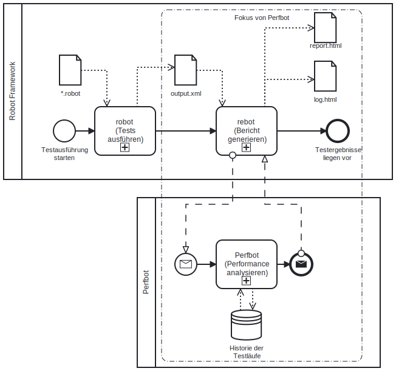
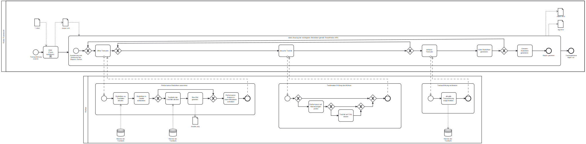
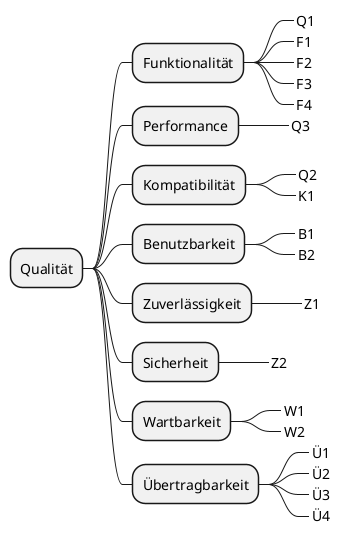

# Perfbot - Architekturdokumentation nach arc42

# Einführung und Ziele

## Aufgabenstellung

**Perfbot** ermittelt Performance-Veränderungen anhand von bestehenden automatisierten UI-Tests. Er erweitert dabei das [Robot Framework](http://www.robotframework.org) um die Möglichkeit, Test-Laufzeiten in einer Datenbank zu speichern und mit den archivierten Laufzeiten der Vergangenheit zu vergleichen. Das Ergebnisse der Performance-Analyse wird in die Robot-Testresults (`log.html` / `report.html`) integriert.

## Qualitätsziele

Hier sind die wichtigsten Qualitätsziele beschrieben. Eine detaillierte Betrachtung der Qualität erfolgt im Kapitel Qualitätsanforderungen (s. u.).

ID | Qualitätsziel                                                                      | Motivation und Erläuterung 
---|---------------------------------------------------------------------------------- | ---------------------------------------------- 
Q1 | Vergleich der Laufzeiten von Robot-Testfällen ermöglichen (Funktionalität)         | Die Kernaufgabe des Tool ist es, eine Performance-Analyse zu bieten. 
Q2 | Integration ins Robot Framework (Kompatibilität)                                   | Das Tool soll ohne Veränderung der bestehenden Robot-Tests genutzt werden können. Die Ergebnisse sollen in die Standard-Ergebnisdokumente integriert werden.
Q3 | Performantes Tool ohne Verlangsamung der eigentlichen Testausführung (Performance) | Die Tool soll die Ausführung der Tests nicht verlangsamen, auch um keine Seiteneffekte auf die Messung zu haben. Auch das Tool selbst soll performant sein z. B. nicht zu viele Datenbankzugriffe tätigen.


## Stakeholder

Rolle                      | Erwartungshaltung
---------------------------|-----------------------
Testautomatisierer         | möchte Hinweise zur Performance der Testfälle bzw. über Performance-Veränderungen des Testobjektes; erwartet eine einfache Integration in sein bisheriges Robot-Setup
Entwicklungsteam           | möchte Performance-Probleme frühzeit entdecken; erhofft sich detaillierte Infos an welcher Komponente die Performance schlechter ist
Anwendungsverantwortlicher (Auftraggeber) | möchte frühzeit über Performance-Probleme in Kenntnis gesetzt werden; möchte Nachweis über Performance des Anwendung
Testmanagement / TA-Team   | möchte das Qualitätsziel "Performance" im Unternehmen stärker in den Fokus setzen; möchte mit reduziertem Aufwand die funktionalen Tests um nicht-funktionale Kennzahlen erweitern
Forscher (Masterarbeit) | möchte beurteilen, ob Kennzahlen zu bestehender UI-Tests brauchbar sind, um Aussagen über die Performance eines Testobjekts zu treffen      

# Randbedingungen 

# Kontextabgrenzung 

Hinweis: Da die Funktionalität dieses Werkzeugs selbst für den Softwaretest genutzt werden soll, ist eine Abgrenzung zwischen fachlichen und technischen Kontext an dieser Stelle schwierig. 

## Fachlicher Kontext

**Was bietet das Tool?**

- Performance-Veränderungen zu bestehen Robot-Testfällen basierend auf archivierten Testläufen ermitteln
- Daten des aktuellen Testlaufs archivieren
- Performance-Analyse in die Robot-Result-Dateien aufbereiten
    - durch tabellarische Darstellung von Vergleichskennzahlen
    - durch grafische Darstellung der Testlaufzeiten im Box-Plot
- Testfälle bei prozentualer Abweichung von den archivierten Testläufen auf FAIL setzten (Testbreaker)

**Wohin bestehen Schnittstellen?**

- zum Robot Framework und der dazugehörige Testausführungs- `robot` bzw. Testberichtgenierungs-Werkzeug `rebot`
- zur Datenbank, die sich um die Persisitierung kümmert

**Was bietet das Tool nicht?**

- es führt selbst keine automatisierten Testfälle aus
- es führt keine Last- und Performancetests im engeren Sinne durch (kann aber genutzt werden, um zu entscheiden, wo Last- und Performancetests mit dafür geeigneten Werkzeugen erfolgen sollen)

## Technischer Kontext 

Das Tool `Perfbot` (orange) integriert sich auf der Testausführungsschicht (schwarz) in das Robot Framework und nutzt dabei die Schnittstelle (API) des Frameworks.


# Lösungsstrategie 

Die grundlegende Lösungsidee zur Performance-Analyse unter Nutzung bestehender UI-Tests ist folgende: Eine generische Erweiterung des im Unternehmen verbreiteten Testautomatisierungswerkzeugs Robot Frameworks zu schaffen. Dadurch sollen Synergieeffekte durch Nutzung bestehender Testfälle und dem bestehenden Knowhow der Testautomatisierer gehoben werden.
Konkret liegt beim Performance-Vergleich folgende Umsetzungsidee vor:
 - speichern der Test-Laufzeiten in einer Datenbank
 - vergleichen der aktuellen Laufzeit mit den archivierten Laufzeiten der Vergangenheit
 - integrieren der Ergebnisse der Performance-Analyse in die Robot-Testresults (`log.html` / `report.html`) 

Die Performance-Analyse soll durch die drei folgenden wichtigsten Funktionen erfolgen:
    - Vergleichskennzahlen: Tabellarische Darstellung verschiedene Kennzahlen (Minimum, Maximum, Durchschnitt, Abweichung vom Durchschnitt) zur früheren Laufzeiten
    - Box-Plot: grafische Aufbereitung der Laufzeiten der Vergangenheit zu jedem Testfall
    - Testbreaker: Testfälle werden als fehlerhaft markiert, wenn ein Schwellwert zu Abweichung von vergangen Test-Laufzeiten überschritten wird.

Die Integration in das Robot Framework ist die wesentliche Technologieentscheidung, dadurch kann die bestehende API des Robot Frameworks genutzt werden. Gleichzeitig schafft dies auch eine klare Abhängigkeit zum Framework und gewisse Technologievorgaben z. B. die Nutzung von Python als Programmiersprache sind damit vorbestimmt.


# Bausteinsicht 

## Komponentendiagramm (Whitebox Gesamtsystem) 

```plantuml

node "Robot Framework" {
    () API
}

node Perfbot {

}

database Sqlite3 {

}

[Perfbot] ..> () API : uses

[Perfbot] ..> () Sqlite3 : uses

```

Siehe auch High-Level-Architektur unter "Technischer Kontext"

**Begründung für diese Darstellungsweise**

Das Komponentendiagramm fasst die wesentlichen Komponenten zusammen. 

**Enthaltene Bausteine**


Bastein                    | Erläuterung
---------------------------|-----------------------
perfbot                    | Perfbot Python-Modul als Blackbox

**Wichtige Schnittstellen**

Schnittstelle              | Erläuterung
---------------------------|-----------------------
Datenbank (hier Sqlite3)   | Für die Speicherung der Testläufe wird eine Datenbank genutzt. Hier wird beispielsweise eine Sqlite3-DB unterstützt.
Robot Framework API        | Die Ausführung des Perfbots wird durch die API des Robot Frameworks getriggert.

## Klassendiagramm

```plantuml


class robot.api.ResultVisitor 
class perfbot.PerfEvalResultModifier 
class perfbot.perfbot #DDDDDD
abstract  perfbot.PersistenceService
class  perfbot.PerfEvalVisualizer
class  perfbot.Sqlite3PersistenceService

perfbot.PerfEvalResultModifier <|-- perfbot.perfbot
robot.api.ResultVisitor <|-- perfbot.PerfEvalResultModifier

perfbot.PerfEvalResultModifier o-- perfbot.PersistenceService
perfbot.PerfEvalResultModifier o-- perfbot.PerfEvalVisualizer
perfbot.PersistenceService <|-- perfbot.Sqlite3PersistenceService

note left of perfbot.perfbot: Starter

```

**Begründung für diese Darstellungsweise**

Das Klassendiagramm gibt einen detaillierten Überblick über die Klassen und damit über die danach gegliederten Quellcode-Dateien. 

**Enthaltene Bausteine**

Bastein                    | Erläuterung
---------------------------|-----------------------
ResultVisitor              | Teil der Robot-API; ermöglicht das Iterieren über die Testergebnisse vor der Report-Generierung
perfbot                    | Wrapper, damit der Aufruf mit dem Parameter --prerebotmodifier perfbot.perfbot aufgerufen werden kann. Eigentliche Logik siehe PerfEvalResultModifier.
PerfEvalResultModifier     |  übernimmt die eigentliche Verarbeitungslogik des Perfbots nach dem Aufruf durch rebot.
PerfEvalVisualizer         | übernimmt die visuelle Aufbereitung z. B. in Box-Plots von Performancedaten der Testfälle.
PersistenceService         | Abstrakte Klasse, um die eigentliche Implementierung, wie die Testlaufergebnisse gespeichert bzw. abgerufen werden zu verschleiern.
Sqlite3PersistenceService  | Konkrete Persistierung der Testergebnisse in einer lokalen Sqlite3-Datei.


# Laufzeitsicht

## Laufzeitsenario Überblick: Testausführung und Berichtgenierung im Überblick



**Begründung für diese Darstellungsweise**

Gibt einen Überblick, wie Perfbot sich in die Kernfunktionen, die das Robot Framework bereitstellt, integriert.

## Laufzeitsicht Details: Testausführung und Berichtgenerierung im Detail



**Begründung für diese Darstellungsweise**

Zeigt den zeitlichen Ablauf und die Triggerpunkte, wo die verschiedenen Perfbot-Funktionen aufgerufen werden.


# Verteilungssicht

- siehe Kompenentdiagramm oben
- Offenes TODO: Perfbot als PyPI Paket verfügbar zu machen

# Architekturentscheidungen

An dieser Stelle sind die wichtigsten Architekturentscheidungen aufgelistet:

ID   | Zusammenfassung                       | Erläuterung/Begründung 
-----|-------------------------------------- | ---------------------------------------------- 
ADR1 | Integration in rebot-Schritt          | Durch die Anbindung in den Rebot-Schritt erfolgt die Ausführung von Perfbot nachgelagert zur Testausführung. Dadurch werden Seiteneffekte (Verlangsamung oder Fehler) auf die eigentliche TA vermieden. Ein Nachteil ist jedoch, dass damit Erkenntnisse des Testbreakers nicht auf der CLI oder in der output.xml berücksichtigt werden. Alternativ kann jedoch mit `rebot`auch eine neue aktualisierte `output.xml`erzeugt werden.
ADR2 | Integration in die Robot-Reports      | Durch die Integration in die `report.html`und `log.html` werden dem Testautomatisierer die Performance-Analyse in die bekannten Ergebnisdateien angezeigt. Er muss keine weiteren Dateien betrachten. Der Gestaltungsfreiraum innerhalb dieser Dokumente ist jedoch dabei etwas beschränkt z. B. können Metadaten-Informationen nur an die Testsuite und nicht an Testfälle gehangen werden. Zudem muss auf den vorhandenen Teststatus-Vorrat (PASS, FAIL, SKIP) für den Testbreaker zurückgegriffen werden.
ADR3 | Eigene DB statt TestArchiver          | Der TestArchiver bietet ein umfassendes Schema für die Speicherung von Testergebnissen inkl. der automatischen Persisitierung durch einen eigenen Listener. Beim Test dieser Tools musste jedoch festgestellt werden, dass die entscheidende Tabelle mit den Ergebnissen der Testfälle nicht gefüllt werden. Deshalb wurde für den MVP eine eigenen DB aufgesetzt. Abhängig von den Erweiterungsoptionen sollte jedoch die Nutzung des TestArchivers (z. B. durch einen Fork) geprüft werden.
ADR4 | Sqlite3 als erste Persistierung       | Für den MVP-Ansatz wurde das Datei-Datenbanksystem Sqlite3 ausgewählt, da es schnell einzurichten ist und das notwendige Python-Modul bereits im Python-Standard-Paket inkludiert ist. Die Erweiterung auf ein "echtes" DBMS wird angestrebt und sollte durch die erweitere Schnittstellendesign problemlos möglich sein.

# Qualitätsanforderungen

## Qualitätsbaum

Im der folgenden Grafik - dem sogenannten Qualitätsbaum (englisch: Utitlty Tree) - werden den Qualitätsmerkmalen den die Qualitätsziele (Qx) aus dem ersten Kapitel und die unten beschriebenen Qualitätsszenarien zugeordnet (Mehrfachnennung möglich).




## Qualitätsszenarien

Konkrete Szenarien werden entweder als Nutzungs-/Anwendungsfall oder als Änderungsszenario, was passiert mit der Qualität bei Weiterentwicklung, angegeben. Die Anfangsbuchstabe der ID soll die Zuordnung zum (am besten passenden) Qualitätsmerkmale verdeutlichen. 

ID  | Szenario
----|-----------------------
F1  | Jeder Testausführung wird für die spätere Performance-Analyse archiviert.
F2  | Die Funktion des Testbreaker lässt sich zeigen, wenn beispielweise ein Sleep in einen Testfall eingebaut wird.
F3  | Die verschiedenen Testläufe eines Testfalls werden im Box-Plot dargestellt.
F4  | Die prozentuale Abweichung vom Durchschnitt zu den vergangen Testläufen wird angezeigt.
B1  | Der Testautomatisierer möchte das Tool ohne umfangreiche Kenntnisse in seinen Testausführungs-CLI-Befehl integrieren.
B2  | Der Testautomatisierer erwartet die Performance-Analyse in den gewohnten Ergebnisdateien.
K1  | Das Tool stellt keine Anforderungen oder Änderungen an die beschriebene Testspezifikation (`*.robot`).
Z1  | Fehler im Perfbot gefährden nicht die eigentliche Testdurchführung z. B. sollen keine Ergebnisse einer langlaufenden Testsuite aufgrund eines Fehlers im Tool verloren gehen.
W1  | Ein Entwickler erwartete eine gute Dokumentation und Struktur des Quellcodes bzw. Repos. 
W2  | Der Entwickler erwartet vorhandene Regressionstests und die Nutzung von statischer Codeanalyse.
Ü1  | Das Tool soll auf einem bestehenden System mit Python/PiP installierbar sein.
Ü2  | Der Tool soll nicht auf die Testfälle eines Unternehmens beschränkt sein.
Ü3  | Das Tool ist um andere Persistierungsmöglichkeiten z. B. das DBMS MongoDB erweiterbar. 
Ü4  | Die Performance-Analyse kann auch auf Schlüsselwörter (oder andere Objekte) erweitert werden. (bereits geschehen)

### Tests

Die Qualität wird mittels automatisierten Regressionstests laufend betrachtet. Einen Überblick über die statische Codeanalyse, Unit- und Integrationstests gibt der [Testplan](tests/Testplan.md).


# Risiken und technische Schulden

Kernrisiko ist, dass die Lösungsidee bzw. die Prämisse nicht trägt. D. h. dass sich bestehende UI-Tests nicht eignen, um Aussagen über die Performance des Testobjektes zu treffen. Dem Gegenüber steht jedoch die Chance, dass die Lösungsidee trägt. Zudem ist die Überprüfung der Prämisse durch die Entwicklung des Perfbots Teil der Forschungsfrage der Masterthesis. 

Die technischen Schulden der jeweiligen Entscheidungen sind bei den Architekturentscheidungen als Nachteile formuliert (s. o.).

# Glossar

Begriff     | Definition
------------|-----------------------
 -/-         | -/-

# Quellen

- diese Markdown-Dokument basiert auf folgender Vorlage:
    -  Template Version 8.2 DE. (basiert auf AsciiDoc Version), Januar 2023, Created, maintained and © by Dr. Peter Hruschka, Dr. Gernot Starke and contributors. Siehe https://arc42.org.
- Deutsches Beispiel für die Arc42-Dokumentation von Stefan Zörner: https://www.dokchess.de
- Merkmale der Produktqualität nach ISO 25010 vgl. Seidl et al., Basiswissen Testautomatisierung, , S. 30


