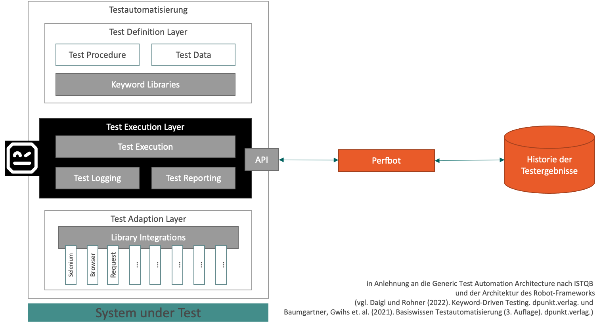
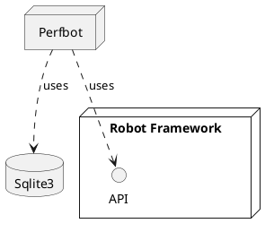

## Perfbot - Architekturdokumentation nach arc42

# TODO: Diese Datei ist in Arbeit

## Bausteinsicht

### Ebene 1 - High-Level-Architektur



### Ebene 2 - Komponentendiagramm -  TODO



### Ebene 3 - Klassendiagramm

```plantuml
class robot.api.ResultVisitor 
class perfbot.PerfEvalResultModifier 
class perfbot.perfbot #DDDDDD
abstract  perfbot.PersistenceService
class  perfbot.PerfEvalVisualizer
class  perfbot.Sqlite3PersistenceService

perfbot.PerfEvalResultModifier <|-- perfbot.perfbot
robot.api.ResultVisitor <|-- perfbot.PerfEvalResultModifier

perfbot.PerfEvalResultModifier o-- perfbot.PersistenceService
perfbot.PerfEvalResultModifier o-- perfbot.PerfEvalVisualizer
perfbot.PersistenceService <|-- perfbot.Sqlite3PersistenceService

note left of perfbot.perfbot: Starter
```


## Quellen
- https://arc42.org