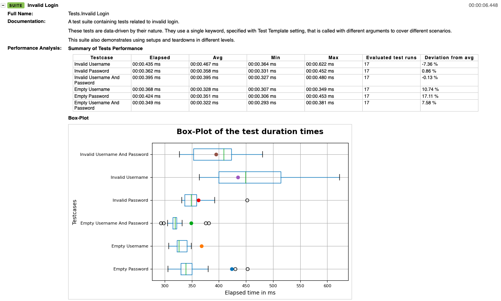
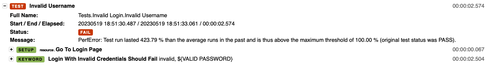
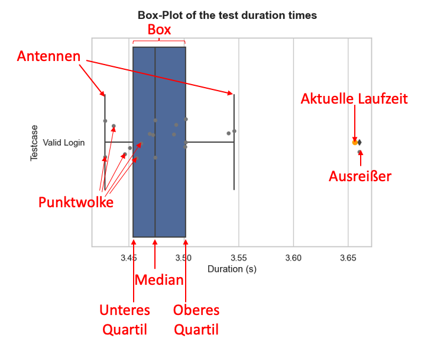

# Perfbot - Robot Framework Performance Analyser


---

**Perfbot** determines performance regression based on existing automated UI tests. The tool extends the [Robot Framework](http://www.robotframework.org) by the possibility to store test runtimes in a database and compare them with archived runtimes of the past. The results of the performance analysis are integrated into the Robot test results (`log.html` / `report.html`).

For more Details incl. Quickstart see the: [README_english.md](README_english.md)

---

**Perfbot** ermittelt Performance-Veränderungen anhand von bestehenden automatisierten UI-Tests. Das Werkzeug erweitert dabei das [Robot Framework](http://www.robotframework.org) um die Möglichkeit, Test-Laufzeiten in einer Datenbank zu speichern und mit den archivierten Laufzeiten der Vergangenheit zu vergleichen. Das Ergebnisse der Performance-Analyse wird in die Robot-Testresults (`log.html` / `report.html`) integriert.


## Installation

Voraussetzung: `python` und `pip` ist installiert (Mindestversion 3.10 (getestet auf 3.11.2 und 3.10.11))

Repository klonen und folgenden Befehl ausführen: 
```bash
python setup.py install
# or
pip install [path to perfbot-folder]
```

## Quickstart

Starten der Robot-Testfälle inkl. Perfbot:
```bash
robot --prerebotmodifier perfbot.perfbot [path to tests]
```
## Funktionsweise

**Perfbot** nutzt den `ResultVisitor` der Robot-API, um über die Tests bzw. deren Ergebnisse zu iterieren und diese in einer Datenbank abzuspeichern. Basierend auf den vergangen Testläufen aus der Datenbank werden die aktuellen Laufzeit der Tests Suite-weise analysiert und das Ergebnis als Metadaten in die Report- bzw. Log-Datei geschrieben. 
Folgende weitere Funktionen stehen zur Verfügung:
- **Box-Plot** (standardmäßig aktiviert): Zu jedem Testfall wird ein [Box-Plot](https://de.wikipedia.org/wiki/Box-Plot) generiert, der die statistische Verteilung der Laufzeiten in Quartile grafisch aufbereitet. Die aktuelle Ausführungszeit des Tests wird mit dem Punkt markiert. Die Box-Plot-Erstellung kann aufgrund ihrer teils langlaufenden Erstellung deaktiviert werden (siehe Konfiguration).
- **Testbreaker** (standardmäßig deaktiviert, Aktivierung siehe Konfiguration): Der Testbreaker vergleicht die Testdauer jedes Testfalls mit einem Maximalwert der prozentualen Abweichungen vom Durchschnitt der letzten Läufe. Lässt sich daraus ein Performanceproblem erkennen, so wir der Testfall auf FAIL gesetzt.
- **Keyword-Archivierung** (standardmäßig aktiviert, in Entwicklung): Neben den Laufzeiten der Testfälle, sind auch die Laufzeiten der darunter liegenden Keywords interessant. Dafür werden auch diese Laufzeiten in der Datenbank gespeichert. Zur Betrachtung der Keyword-Laufzeiten wurde eine weiteres Tool namens [Perfmetrics](https://git.fh-muenster.de/robotframework-performance/perfmetrics). Diese ermöglicht eine detailerte Betrachtung der Performance von Test- und Schlüsselwörtern.

## Konfiguration

Starten der Robot-Testfälle inkl. perfbot (standardmäßig mit Box-Plot-Modus und ohne Testbreaker-Modus):
```bash
robot --prerebotmodifier perfbot.perfbot [path to tests]
```

Angabe, welche [Sqlite3-Datenbank](https://docs.python.org/3/library/sqlite3.html) mit archivierten Testlaufzeiten genutzt werden soll (standardmäßig wird eine Datenbank mit dem Namen `robot-exec-times.db` erzeugt bzw. verwendet):
```bash
robot --prerebotmodifier perfbot.perfbot:db_path=[path to sqlite3 file] [path to tests]
```

Aktivierung des Testbreaker-Modus:  
Beispiel: Bei einer Abweichung (`devn`) der Testlaufzeit von 10% vom Durchschnitt der vergangen Testläufe soll der Testfall auf FAIL gesetzt werden. (Hinweis: Perfbot läuft im Rebot-Schritt, die `output.xml` und CLI-Ausgaben werden durch den Testbreaker deshalb nicht verändert)
```bash
robot --prerebotmodifier perfbot.perfbot:devn=0.1:testbreaker=True [path to tests]
```

Deaktivierung und Konfiguration des Box-Plot-Modus:  
Die Generierung des Box-Plots benötigt weitere Datenbank-Zugriffe und zudem die Funktionen der Python-Module `pandas` und `matplotlib`. Zur Beschleunigung der Erstellung der Log- und Report-Dateien und zur Dependency-Reduzierung lässt sich der Box-Plot-Modus deaktivieren. Bei aktivierten Box-Plot-Modus kann der Ablageort  mit dem Parameter `boxplot_folder` angegeben werden. Sofern der robot-Parameter `--outputdir` verwendet wird, muss der Ablageort als absoluter Pfad eingetragen werden.
```bash
robot --prerebotmodifier perfbot.perfbot:boxplot="False":boxplot_folder="perfbot-graphics/" [path to tests]
```

Lesender Zugriff auf Datenbank:
Um lediglich die Performance zu analyisieren, jedoch nicht den aktuellen Testlauf in die Datenbank zu schreiben, so kann folgende Konfiguration genutzt werden:
```bash
robot --prerebotmodifier perfbot.perfbot:readonly=True [path to tests]
```

Deaktivierung der Keyword-Speicherung: 
Die Keyword-Analyse erfolgt nach gelagert mittels [Perfmetrics](https://git.fh-muenster.de/robotframework-performance/perfmetrics) (siehe oben). Sofern die Betrachtung der Keywords nicht relevant ist, kann zugunsten eines schnelleren Perfbots die Speicherung der Keyword-Laufzeiten deaktiviert werden:
```bash
robot --prerebotmodifier perfbot.perfbot:keywordstats=False [path to tests]
```

Ausführen von Perfbot mittels `rebot`:
Die `log.html` und `report.html` von Robot-Testfällen können auch ohne Testausführung basierend auf der `output.xml` generiert werden.
D. h. Perfbot kann nachträglich ohne Ausführung der Tests gestartet werden.
Dazu ist eine bestehende `output.xml` nötig. Bei der Ausführung von Perfbot mittes `rebot` kann neben den HTML-Dokumenten auch eine neue  `output.xml` erzeugt werden, die dann auch den fehlgeschlagene Tests des Testbreaker enthält.
Hinweis: Standardmäßig führt jede Ausführung von Perfbot zu neuen Datensätzen, doppelte Ausführungen zu gleichen Testdurchläufen sollte deshalb vermieden werden bzw. dann der Readonly-Modus genutzt werden.
```bash
# Vgl. untenstehendes Beispiel
rebot --prerebotmodifier perfbot.perfbot:devn=0.1:db_path="example/robot-exec-times.db":testbreaker=True --output example/newoutput.xml example/output.xml
```

Ausführung von Perfbot mit allen möglichen Parameter:
Hinweis zum Entwicklungsstand: Nicht zu alle Parameter sind andere Werte als die Defaults auswählbar. 
```bash
robot --prerebotmodifier perfbot.perfbot:stat_func='avg':devn=0.1:db_path="example/robot-exec-times.db":boxplot=True:boxplot_folder="perfbot-graphics/":testbreaker=True:keywordstats="True":readonly="False" [path to tests]
```

## Beispiel Login-Page
Im Ordner `./example` sind Beispiel-Testfälle aus der Repo der Selenium-Library (entnommen aus https://github.com/robotframework/SeleniumLibrary)  abgelegt. Die Tests wurden mehrmals mit Perfbot ausgeführt. Ebenfalls dort sind die dazugehörige Datenbank `robot-exec-times.db` und die Robot-Testresults (`log.html` / `report.html`), in denen die Performance-Analyse berichtet wurde, zu finden. Mit folgenden Befehl lassen sich das Beispiel starten (Installation der SeleniumLibrary vorausgesetzt):
```bash
# 1. Starten des System-under-Test (Login-Page)
python example/sut/server.py
# 2. Ausführung der Tests inkl. Perfbot
robot --prerebotmodifier perfbot.perfbot:devn=0.1:db_path="example/robot-exec-times.db":testbreaker=True example/tests
```
Screenshot 1: Einbindung der Performance-Analyse in die Log-Datei:


Screenshot 2: Testbreaker in Aktion am Beispiel des Beispiels Login-Page


## Box-Plot-Legende



| Kennwert | Beschreibung | Lage im Box-Plot
|--|--|--
| Unteres Quartil | Die kleinsten 25 % der Datenwerte sind kleiner als dieser oder gleich diesem Kennwert | Beginn der Box
| Median | Die kleinsten 50 % der Datenwerte sind kleiner als dieser oder gleich diesem Kennwert | Strich innerhalb der Box
| Oberes Quartil | Die kleinsten 75 % der Datenwerte sind kleiner als dieser oder gleich diesem Kennwert | Ende der Box
| Antenne (Whisker) | Bis 1,5-facher Interquartilabstand (Länge der Box) werden auf beiden Seiten die Antennen dargestellt. | Antennen
| Ausreißer | Alle Punkte außerhalb der Antennen | Einzelne Punkte (Raute)
| Einzelwerte | Alle Einzelwerte werden als Punktwolke dargestellt. | Punktwolke (rund/grau)
| Aktuelle Laufzeit | Dauer des Testfalls/Keywords im der gerade betrachteten Testlauf. | oranger Punkt

Quelle der Tabelle: [Wikipedia](https://de.wikipedia.org/wiki/Box-Plot) [Seaborn-Docs](https://seaborn.pydata.org/generated/seaborn.boxplot.html)

## Technische Dokumentation 

Für weitere Details u. a. den architektonischen Aufbau siehe [ARC42_DOC.md](ARC42_DOC.md).
Einen Überblick über die statische Codeanalyse, Unit- und Integrationstests gibt der [Testplan](tests/Testplan.md).

## Quellen
Für den Aufbau dieses Repositories wurde auf die Docs der entsprechenden Technologien zurückgegriffen und ggf. Codeschnipsel aus Implementierungsbeispielen übernommen. Im Folgenden eine Auflistung der entsprechenden Docs, Tutorials und Implementierungsbeispielen:

-   [Robot Framework User Guide](https://robotframework.org/robotframework/latest/RobotFrameworkUserGuide.html) Version 6.0.2, insbesondere:
    - Kapitel *4.3 Listener interface* und zugehöriger Unterpunkt *Modifying execution and results*
    - Kapitel *3.6.9 Programmatic modification of results* inkl. Listing *ExecutionTimeChecker*
-  [Robot Framework API documentation](https://robot-framework.readthedocs.io/en/latest/index.html#robot-framework-api-documentation)
- [SeleniumLibrary](https://github.com/robotframework/SeleniumLibrary) bzw. deren Beispielprojekt zum Ausprobieren dieser Implementieren (siehe `example`)
- Erweiterung von [robotmetrics](https://github.com/adiralashiva8/robotframework-metrics)
- verwendete Python-Module inkl. Links zu den Docs:
    - [Robot Framework](http://www.robotframework.org)
    - [Pandas](https://pandas.pydata.org/docs/)
    - [Matplotlib](https://matplotlib.org/stable/index.html)
    - [Sqlite3](https://docs.python.org/3/library/sqlite3.html)
    - [Seaborn](https://seaborn.pydata.org)
    - Python3 (allgemein): [PythonDocs](https://docs.python.org/3/),[Python3 - Ein umfassende Handbuch](https://openbook.rheinwerk-verlag.de/python/),[W3Schools](https://www.w3schools.com/python/default.asp), [Pythonbuch](https://pythonbuch.com)
- das Logo von Perfbot basiert auf dem [Robot Framework logo](https://github.com/robotframework/visual-identity) und ist damit unter  [Creative Commons Attribution-ShareAlike 4.0 International License (CC BY-SA 4.0)](https://creativecommons.org/licenses/by-sa/4.0/) lizensiert

## Lizenz
© Lennart Potthoff / MIT-Lizenz

## Schlussbemerkung
Perfbot wurde im Rahmen einer Masterthesis erstellt:  
Titel der Masterthesis: Automatisierte Performance-Analyse von IT-Anwendungen mit dem Testautomatisierungswerkzeug Robot Framework und Evaluation bei einem Versicherungsunternehmen  
Student: Lennart Potthoff  
Studiengang: M. Sc. Wirtschaftsinformatik (in Teilzeit)  
Semester: Sommersemester 2023  
Hochschule: FH Münster
