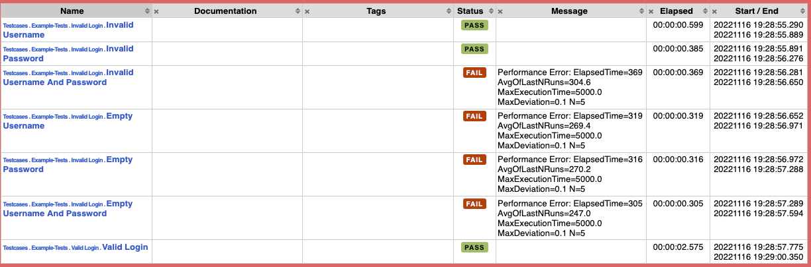

# Proof-of-Concept: Robot-Testfälle als Indikator für Performance-Probleme nutzen

## Idee

Mittels Modifizer oder Listener wird während der Laufzeit die aktuelle Testdauer jedes Testfalls analyisiert und mit einem Maximalwert und dem Durchschnitt der letzten Läufe der Vergangenheit verglichen. Lässt sich daraus ein Performanzproblem erkennen, so wir der Testfall auf Fehlerhaft gesetzt und mit einer Message ausgestattet.

## Architektur / Inhalt

- `perf_analyser/PerfEvalListener.py`: Robot-Listener, der währrend der Laufzeit die Testfälle analysiert
- `perf_analyser/PerfEvalResultModifier.py`: Robot-Result-Listner, der nach der Ausführung der Test die Performanz analysiert und die Ergebnisse in der log.html und report.html festhält
- `perf_analyser/Sqlite3PersistenceService.py`: Zugriff und Persistierung der Testläufe mittels Sqlite3-Datenbank

## Quick Start
```bash
# Starten des System-under-Test
python3 sut/server.py

# Ausführung der beispielhaften Tests ohne PerfEval
# Vorher: Installationsanleitung gemäß https://github.com/robotframework/SeleniumLibrary
python3 -m robot testcases

# Ausführung der Tests mit PerfEval als ResultModifier
# Erläuterung: Der ResultModifier läuft nach der Ausführung aller Tests und verändert nur die log.html und report.html
python3 -m robot --prerebotmodifier perf_analyser/PerfEvalResultModifier.py -L info testcases

# Ausführung der Tests mit PerfEval als Listener
python3 -m robot --listener perf_analyser/PerfEvalListener.py -L info testcases

# Ausführung mit Parametern
python3 -m robot --prerebotmodifier perf_analyser/PerfEvalResultModifier.py:stat_func=avg:devn=0.1:mode=break_test:db_path=robot-exec-times.db -L info testcases   

# Generierung der Boxplots
python3 -m robot --prerebotmodifier perf_analyser/PerfEvalResultModifier.py:stat_func='avg':devn=0.1:mode='boxplot':db_path="robot-exec-times.db" -L info testcases

```


## Screenshot



## Quellen
- Robot-Modifizer: https://robotframework.org/robotframework/latest/RobotFrameworkUserGuide.html#toc-entry-532
- Alternative Lösung über Listener denkbar: https://robotframework.org/robotframework/latest/RobotFrameworkUserGuide.html#toc-entry-625
- https://github.com/robotframework/SeleniumLibrary
