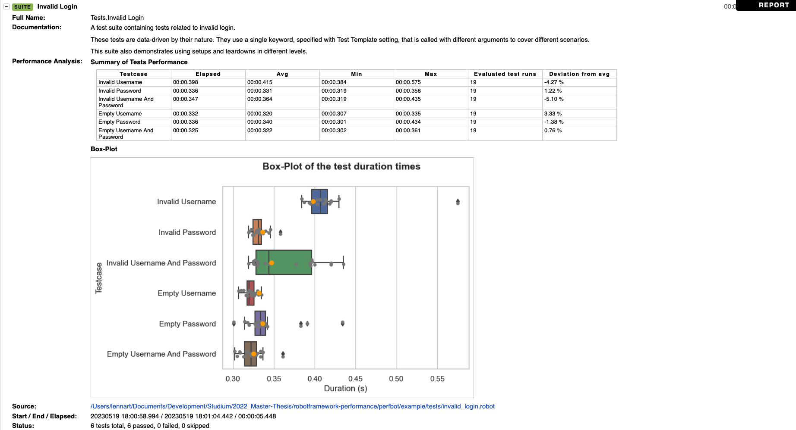

# Perfbot - Robot Framework Performance Analyser


---

**Perfbot** determines performance regression based on existing automated UI tests. The tool extends the [Robot Framework](http://www.robotframework.org) by the possibility to store test runtimes in a database and compare them with archived runtimes of the past. The results of the performance analysis are integrated into the Robot test results (`log.html` / `report.html`).


## Installation
Requires `python` und `pip` in Version 3.10. or higher

Clone Repository and run this command: 
```bash
python setup.py install
# or
pip install [path to perfbot-folder]
```

## Quickstart

Start the robot test cases including perfbot:
```bash
robot --prerebotmodifier perfbot.perfbot [path to tests]
```
## Functionality

**Perfbot** uses the `ResultVisitor` of the Robot API to iterate over the tests or their results and store them in a database. Based on the past test runs from the database, the current runtime of the tests are analyzed suite-wise and the result is written as metadata to the report or log file. 
The following additional functions are available:
- **Box Plot** (enabled by default): A [box plot](https://de.wikipedia.org/wiki/Box-Plot) is generated for each test case, which graphically displays the statistical distribution of runtimes in quartiles. The current execution time of the test is marked with the dot. The box plot generation can be disabled due to its partly long-running generation (see configuration).
- **Testbreaker** (deactivated by default, activation see configuration): The testbreaker compares the test duration of each test case with a maximum value of the percentage deviations from the average of the last runs. If this indicates a performance problem, the test case is set to FAIL.
- **Keyword archiving** (enabled by default, under development): In addition to the runtimes of the test cases, the runtimes of the underlying keywords are also interesting. For this purpose, these runtimes are also stored in the database. To view the keyword runtimes, another tool called [Perfmetrics](https://git.fh-muenster.de/robotframework-performance/perfmetrics) has been added. This allows a detailed view of the performance of test and keywords.


## Configuration

Starting the robot test cases incl. perfbot (by default with box plot mode and without testbreaker mode):
``bash
robot --prerebotmodifier perfbot.perfbot [path to tests]
```


Starting Perfbot with all possible parameters
```bash
robot --prerebotmodifier perfbot.perfbot:stat_func='avg':devn=0.1:db_path="example/robot-exec-times.db":boxplot=True:boxplot_folder="perfbot-graphics/":testbreaker=True:keywordstats="True":readonly="False" [path to tests]
```

Running Perfbot with rebot for generating a new output.xml
```bash
rebot --prerebotmodifier perfbot.perfbot:devn=0.1:db_path="example/robot-exec-times.db":testbreaker=True --output example/newoutput.xml example/output.xml
```

## Example Login-Page
The `./example` folder contains sample test cases from the Selenium library repo (taken from https://github.com/robotframework/SeleniumLibrary). The tests were executed several times with Perfbot. Also there are the corresponding database `robot-exec-times.db` and the robot test results (`log.html` / `report.html`) where the performance analysis was reported. The following command can be used to start the example (assuming the SeleniumLibrary is installed):
```bash
# 1. Starting the  system-under-test (Login-Page)
python example/sut/server.py
# 2. Running rests and perfbot
robot --prerebotmodifier perfbot.perfbot:devn=0.1:db_path="example/robot-exec-times.db":testbreaker=True example/tests
```
Screenshot 1: Included performance analysis in log.html:


Screenshot 2: Testbreaker


## Technical documentation and References

Currently only available in german: see README.md, [ARC42_DOC.md](ARC42_DOC.md), [Testplan](tests/Testplan.md).


## License
© Lennart Potthoff / MIT-Lizenz

Translated with www.DeepL.com/Translator (free version)